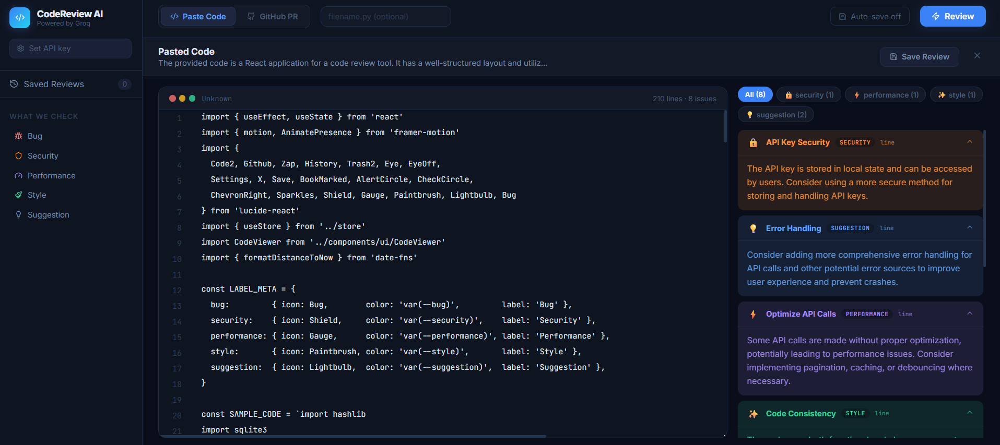

# CodeReview AI — Instant AI code reviews

> Paste code or drop a GitHub PR URL. Get line-by-line AI feedback labeled bug / security / performance / style / suggestion — powered by Groq.

---

## Quick Start

Live Demo: [](#)

---

## Preview




### Backend
```bash
cd backend
py -3.12 -m venv venv
venv\Scripts\activate        # Windows
source venv/bin/activate      # Mac/Linux

pip install -r requirements.txt

copy .env.example .env        # Windows
cp .env.example .env           # Mac/Linux
# Add GROQ_API_KEY to .env

uvicorn app.main:app --reload
# Runs on http://localhost:8000
```

### Frontend
```bash
cd frontend
npm install
npm run dev
# Runs on http://localhost:5173
```

---

## Features

| Feature | Details |
|---------|---------|
| Paste code | Paste any code, optionally add filename for better language detection |
| GitHub PR | Paste a PR URL, fetches diff automatically |
| AI review | Groq LLaMA 3.3 70B analyzes and returns line-by-line comments |
| Labels | bug · security · performance · style · suggestion |
| Severity | critical · major · minor · info |
| Suggested fixes | Each comment includes an optional fixed code snippet |
| Filter | Filter comments by label |
| Save | Choose to save review before or after running |
| History | Browse and reload past saved reviews |
| Sample code | Built-in Python auth snippet with intentional bugs to demo |

## Environment Variables

```env
GROQ_API_KEY=gsk_...
GROQ_MODEL=llama-3.3-70b-versatile
GITHUB_TOKEN=ghp_...   # optional, increases GitHub rate limit
DATABASE_URL=sqlite+aiosqlite:///./codereview.db
SECRET_KEY=change-me-in-production
FRONTEND_URL=http://localhost:5173
```

## GitHub Token (optional)

Without a token: 60 GitHub API requests/hour (usually enough)
With a token: 5,000 requests/hour

Get one at github.com → Settings → Developer settings → Personal access tokens → Fine-grained → public repos read access.

## Deploy

### Render — Backend (Web Service)
- Root Directory: `backend`
- Build: `pip install -r requirements.txt`
- Start: `uvicorn app.main:app --host 0.0.0.0 --port $PORT`
- Env vars: `GROQ_API_KEY`, `FRONTEND_URL`

### Render — Frontend (Static Site)
- Root Directory: `frontend`
- Build: `npm install && npm run build`
- Publish: `dist`
- Env vars: `VITE_API_URL=https://your-backend.onrender.com`
